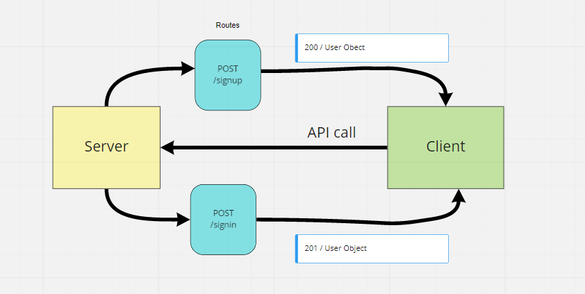

# basic-auth

## Author

B. Kasprzyk

[Heroku](https://basic-auth-bk.herokuapp.com/)

[GitHub](https://github.com/bkasprzyk19/basic-auth)

[Actions](https://github.com/bkasprzyk19/basic-auth/actions)





## Installation

npm install or npm i

``` json
"dependencies": {
    "base-64": "^1.0.0",
    "bcrypt": "^5.0.0",
    "cors": "^2.8.5",
    "dotenv": "^8.2.0",
    "express": "^4.17.1",
    "jest": "^26.6.3",
    "pg": "^8.6.0",
    "sequelize": "^6.6.2",
    "sequelize-cli": "^6.2.0",
    "sqlite3": "^5.0.2"
  }

```

## Summary of Problem Domain

Refactor the server, seperate the files and 

## Links to application deployment

https://basic-api-server-b.herokuapp.com/


## Routes

HTTP POST's
Path: /signin
Path: /signup


## Phase 1: Basic Authentication
- Create a basic express server with the following features:
- Users Model (Mongoose Schema)
- /signup route that creates a user
- /signin route that attempts to log a user in
- BasicAuth middleware that validates the user as a part of the /signin process
- Implement: Modularize and Test a starter server
## Phase 2: Bearer Authentication
- Re-Authenticate Users
- Accepts a TOKEN in the Authorization: Bearer header
- Validates the user
- Allows or Denies access to the route handler
- Implement: Debug, Extend Token Security
## Phase 3: Authorization
- Role Based Authorization System
- Combines the Bearer Token with User roles to give fine grained access control
- Implement: Protect API Routes, Write tests
